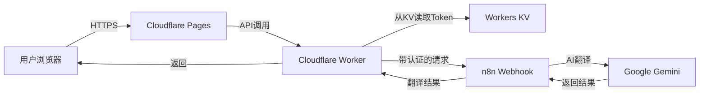

# 🌐 日中翻訳 Web Application

<div align="center">

**AI駆動の日本語→中国語ビジネス翻訳Webアプリケーション**

[](https://opensource.org/licenses/MIT)
[](https://workers.cloudflare.com/)
[](https://n8n.io/)

[デモを見る](#) | [クイックスタート](QUICK_DEPLOY.md) | [ドキュメント](README.md)

</div>

---

## ✨ 特徴

<table>
<tr>
<td width="50%">

### 🎨 美しいUI
- 洗練された深色テーマ
- レスポンシブデザイン
- 流暢なアニメーション
- 直感的な操作

</td>
<td width="50%">

### 🚀 高性能
- 60秒タイムアウト機制
- グローバルCDN配信
- Rate limiting保護
- リアルタイム翻訳

</td>
</tr>
<tr>
<td width="50%">

### 🔒 セキュア
- Token完全隐藏
- Cloudflare Workers代理
- Header認証対応
- HTTPS加密通信

</td>
<td width="50%">

### 💰 無料
- Cloudflare免費套餐
- 個人使用完全免費
- 100,000次請求/日
- 零維護成本

</td>
</tr>
</table>

---

## 🎯 快速开始

### 选项1: 本地测试（5分钟）

```bash
# 1. 克隆项目
git clone https://github.com/yourusername/translation.git
cd translation

# 2. 配置n8n webhook URL
# 编辑 script.js 第4行

# 3. 启动本地服务器
python3 -m http.server 8000

# 4. 打开浏览器
open http://localhost:8000
```

### 选项2: 部署到Cloudflare（15分钟）

🔒 **推荐用于生产环境**

```bash
# 1. 安装Wrangler
npm install -g wrangler

# 2. 登录Cloudflare
wrangler login

# 3. 部署Worker
wrangler deploy

# 4. 推送到GitHub并连接Pages
git push origin main
```

📖 **详细步骤**: 查看 [QUICK_DEPLOY.md](QUICK_DEPLOY.md)

---

## 📸 预览

<div align="center">

### 输入日文


### 获取中文翻译


</div>

---

## 🏗️ 架构



---

## 📚 文档索引

| 文档 | 描述 | 语言 |
|------|------|------|
| [README.md](README.md) | 完整使用说明 | 🇯🇵 日本語 |
| [QUICK_DEPLOY.md](QUICK_DEPLOY.md) | 快速部署指南 | 🇨🇳 中文 |
| [CLOUDFLARE_DEPLOYMENT.md](CLOUDFLARE_DEPLOYMENT.md) | Cloudflare详细部署 | 🇨🇳 中文 |
| [WEBHOOK_CONFIG.md](WEBHOOK_CONFIG.md) | n8n Webhook配置 | 🇨🇳 中文 |
| [PROJECT_SUMMARY.md](PROJECT_SUMMARY.md) | 项目总结 | 🇨🇳 中文 |

---

## 🛠️ 技术栈

<table>
<tr>
<td align="center" width="20%">

<br>HTML5
</td>
<td align="center" width="20%">

<br>CSS3
</td>
<td align="center" width="20%">

<br>JavaScript
</td>
<td align="center" width="20%">

<br>Cloudflare
</td>
<td align="center" width="20%">

<br>n8n
</td>
</tr>
</table>

---

## 📋 功能清单

- [x] 日文输入，实时字符计数
- [x] AI翻译（Google Gemini）
- [x] 中文结果显示，保留换行
- [x] 一键复制翻译结果
- [x] 60秒超时保护
- [x] Rate limiting（10次/分钟）
- [x] 错误处理和友好提示
- [x] 响应式设计
- [x] 深色主题
- [x] 加载状态动画
- [x] Cloudflare全栈部署

---

## 🔐 安全性

### 保护措施
✅ **Token隐藏**: 存储在Workers KV，前端完全看不到  
✅ **URL保护**: n8n真实地址不暴露  
✅ **HTTPS加密**: 全程加密传输  
✅ **Rate Limiting**: 防止滥用（10次/分钟/IP）  
✅ **CORS控制**: 可限制访问域名  
✅ **Header Auth**: 支持n8n认证  

### 安全评分: ⭐⭐⭐⭐☆ (4/5)

---

## 💰 成本分析

使用Cloudflare免费套餐：

| 服务 | 免费额度 | 成本 |
|------|----------|------|
| Cloudflare Workers | 100,000次请求/天 | **$0** |
| Cloudflare Pages | 500次构建/月 | **$0** |
| Workers KV | 100,000次读取/天 | **$0** |
| n8n (自托管) | 无限制 | **$0** |

**总计: $0/月** 🎉

---

## 🚀 立即开始

### 方式1: 在线体验
访问演示站点: [https://translation.pages.dev](#)

### 方式2: 本地运行
```bash
git clone https://github.com/yourusername/translation.git
cd translation
python3 -m http.server 8000
```

### 方式3: 部署自己的
查看 [快速部署指南](QUICK_DEPLOY.md)

---

## 🤝 贡献

欢迎提交Issue和Pull Request！

1. Fork本项目
2. 创建特性分支 (`git checkout -b feature/AmazingFeature`)
3. 提交更改 (`git commit -m 'Add some AmazingFeature'`)
4. 推送到分支 (`git push origin feature/AmazingFeature`)
5. 创建Pull Request

---

## 📝 许可证

本项目采用 [MIT License](LICENSE) 开源。

---

## 🙏 致谢

- [n8n](https://n8n.io/) - 强大的工作流自动化平台
- [Cloudflare](https://www.cloudflare.com/) - 全球CDN和边缘计算
- [Google Gemini](https://deepmind.google/technologies/gemini/) - AI翻译引擎

---

## 📞 支持

- 📖 [查看文档](README.md)
- 🐛 [报告Bug](https://github.com/yourusername/translation/issues)
- 💡 [功能建议](https://github.com/yourusername/translation/issues)
- 📧 Email: your-email@example.com

---

<div align="center">

**用❤️制作 | Powered by n8n & Cloudflare**

[⬆ 回到顶部](#-日中翻訳-web-application)

</div>
